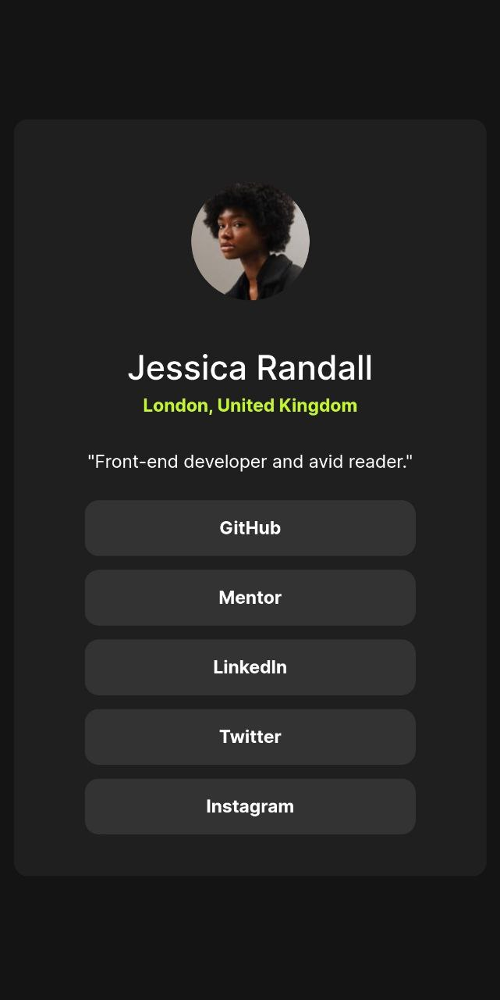

# 😶‍🌫️ Social Links Profile - Page Solution

This is my first solution to the [Social Links Profile page challenge on Frontend Mentor](https://www.frontendmentor.io/challenges/recipe-page-KiTsR8QQKm) and took me about 2.5 hours to complete. Frontend Mentor challenges help you improve your coding skills by building realistic projects. If you are a beginner you really need to try this!

## 🪞 Screenshots

## 🎥 Live WebSite

- Live Site URL: [Add live site URL here](https://alexandru-ghergu.github.io/social-links-profile-main/)

## 🪄 Technologies

- `HTML5`
- `CSS`
- `Flexbox`

## 🎢 What I learned

- How to organize better the `HTML` file.
- How percentage and relative units works.
